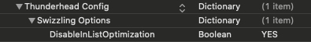

## Table of Contents

- [Requirements](#requirements)
  * [iOS version requirements](#ios-version-requirements)
- [Installation](#installation)
  * [CocoaPods](#cocoapods)
  * [Manual installation](#manual-installation)
    + [Adding the SDK dependencies for manual installation](#adding-the-sdk-dependencies-for-manual-installation)
    + [Biometric authentication](#biometric-authentication)
- [Use the codeless Thunderhead SDK for iOS](#use-the-codeless-thunderhead-sdk-for-ios)
  * [Initialize the SDK](#initialize-the-sdk)
    + [Import the SDK’s module](#import-the-sdks-module)
    + [Set up the SDK in User mode](#set-up-the-sdk-in-user-mode)
    + [Set up the SDK in Admin mode](#set-up-the-sdk-in-admin-mode)
    + [For Salesforce Interaction Studio integrations](#for-salesforce-interaction-studio-integrations)
    + [`ViewController`/`View` lifecycle overriding rules](#viewcontrollerview-lifecycle-overriding-rules)
- [Additional features](#additional-features)
  * [Opt an end-user out of or into tracking](#opt-an-end-user-out-of-or-into-tracking)
    * [Opt an end-user out/in of all tracking](#opt-an-end-user-outin-of-all-tracking)
      + [Opt an end-user out of all tracking](#opt-an-end-user-out-of-all-tracking)
      + [Opt an end-user in for all tracking](#opt-an-end-user-in-for-all-tracking)
    * [Opt an end-user out/in of all keychain Tid storage](#opt-an-end-user-outin-of-all-keychain-tid-storage)
      + [Opt an end-user out of all keychain Tid storage](#opt-an-end-user-out-of-all-keychain-tid-storage)
      + [Opt an end-user in for all keychain Tid storage](#opt-an-end-user-in-for-all-keychain-tid-storage)
    * [Opt an end-user out/in of all pasteboard Tid storage](#opt-an-end-user-outin-of-all-pasteboard-tid-storage)
      + [Opt an end-user out of all pasteboard Tid storage](#opt-an-end-user-out-of-all-pasteboard-tid-storage)
      + [Opt an end-user in for all pasteboard Tid storage](#opt-an-end-user-in-for-all-pasteboard-tid-storage)
    * [Opt an end-user out/in of city/country level tracking](#opt-an-end-user-outin-of-citycountry-level-tracking)
      + [Opt an end-user out of all city/country level tracking](#opt-an-end-user-out-of-all-citycountry-level-tracking)
      + [Opt an end-user in for all city/country level tracking](#opt-an-end-user-in-for-all-citycountry-level-tracking)   
    * [Partial opt out/in example](#partial-opt-outin-example)
  * [Disable in-list Optimizations](#disable-in-list-optimizations)
  * [Late initialization and reconfiguration of the SDK](#late-initialization-and-reconfiguration-of-the-sdk)
  * [Manually set a specific Interaction path](#manually-set-a-specific-interaction-path)
  * [Exclude an Interaction](#exclude-an-interaction)
  * [Disable automatic Interaction detection](#disable-automatic-interaction-detection)
  * [Send Interactions to Thunderhead ONE or Salesforce Interaction Studio](#send-interactions-to-thunderhead-one-or-salesforce-interaction-studio)
    + [Send an Interaction request](#send-an-interaction-request)
    + [Send an Interaction request and retrieve the response](#send-an-interaction-request-and-retrieve-the-response)
  * [Retrieve a response for an automatically triggered Interaction request](#retrieve-a-response-for-an-automatically-triggered-interaction-request)
    + [Retrieve a response for other instances](#retrieve-a-response-for-other-instances)
  * [Send Properties to Thunderhead ONE or Salesforce Interaction Studio](#send-properties-to-thunderhead-one-or-salesforce-interaction-studio)
    + [Send Properties to a base Touchpoint](#send-properties-to-a-base-touchpoint)
    + [Send Properties to an Interaction](#send-properties-to-an-interaction)
    + [Send an Interaction request with Properties](#send-an-interaction-request-with-properties)
    + [Send an Interaction request with Properties and retrieve the response](#send-an-interaction-request-with-properties-and-retrieve-the-response)
    + [Send a response code](#send-a-response-code)
  * [Identity sync](#identity-sync)
    + [Identity sync with Thunderhead ONE or Salesforce Interaction Studio](#identity-sync-with-thunderhead-one-or-salesforce-interaction-studio)
    + [Identity sync with Thunderhead ONE or Salesforce Interaction Studio and your web Touchpoint](#identity-sync-with-thunderhead-one-or-salesforce-interaction-studio-and-your-web-touchpoint)
  * [Ability to whitelist identity transfer links](#ability-to-whitelist-identity-transfer-links)
  * [Ability to blacklist identity transfer links](#ability-to-blacklist-identity-transfer-links)
  * [Disable automatic identity transfer](#disable-automatic-identity-transfer)
    + [Send Properties for a `URL` `one-tid` scheme](#send-properties-for-a-url-scheme)
    + [Append a `one-tid` parameter to a `NSURL` to facilitate identity transfer](#append-a-one-tid-parameter-to-a-nsurl-to-facilitate-identity-transfer)
  * [Disable automatic outbound link tracking](#disable-automatic-outbound-link-tracking)
    + [Programmatically trigger an outbound link tracking Interaction call](#programmatically-trigger-an-outbound-link-tracking-interaction-call)
  * [Enable push notifications](#enable-push-notifications)
  * [Get a push token](#get-a-push-token)
  * [Send a push token](#send-a-push-token)
  * [Handle notifications received through the ONE APNs interface](#handle-notifications-received-through-the-one-apns-interface)
      - [Handling notifications while the app in foreground or background](#handling-notifications-while-the-app-in-foreground-or-background)
      - [Displaying notifications while the app in foreground](#displaying-notifications-while-the-app-in-foreground)
  * [Send a location object](#send-a-location-object)
  * [Get a structure data](#get-a-structure-data)
  * [Get Tid](#get-tid)
  * [Access debug information](#access-debug-information)
  * [Identify the framework version](#identify-the-framework-version)
  * [Clear the user profile](#clear-the-user-profile)
- [Troubleshooting guide](#troubleshooting-guide)
- [Questions or need help](#questions-or-need-help)
  * [Salesforce Interaction Studio support](#salesforce-interaction-studio-support)
  * [Thunderhead ONE support](#thunderhead-one-support)

## Requirements

The Thunderhead SDK for iOS supports iOS 8.0 and above.

### iOS version requirements

+ iOS minimum version (deployment target): iOS 8.0
+ iOS base SDK version: iOS 13.0
+ Xcode minimum version: 11.0

## Installation

### CocoaPods

Make sure you have the [CocoaPods](http://cocoapods.org) dependency manager installed. You can do so by executing the following command:

```sh
$ gem install cocoapods
```

Specify the *Thunderhead SDK* in your podfile

```txt
# Thunderhead SDK
    target :YourTargetName do
    pod 'Thunderhead', '~> 5.3.0'
    end
```

Install using the following command:

```sh
$ pod install
```

See example project for pod installation [here](https://github.com/thunderheadone/one-sdk-ios/tree/master/examples/dynamic-initialization-example).

### Manual installation

1. [Download the latest Thunderhead SDK for iOS](https://github.com/thunderheadone/one-sdk-ios/releases) and extract the zip.
2. Open your existing iOS application Xcode project.
3. Import the Thunderhead.embeddedframework into your project.
4. Confirm the SDK files have been added to your project, as follows:
    + Navigate to your project build settings by selecting your project's Project File in the Project Navigator.
    + Select the main build target for your app.
    + Select the **Build Phases** tab.
    + Confirm **_Thunderhead.framework_** is located in the **Link Binary With Libraries** section.
    + Confirm **_ThunderheadBundle.bundle_** is located in the **Copy Bundle Resources** section.
5. Ensure your project enables modules by going to **Build Settings** tab and setting the flag for **Enable Modules (C and Objective-C)** to **Yes**. Check out **_Adding the SDK dependencies for manual installation_** if you need modules to be disabled.

See example project for manual installation [here](https://github.com/thunderheadone/one-sdk-ios/tree/master/examples/optimizing-programmatically-using-json-example).

*Note:*
- If you encounter the `No such module 'Thunderhead'` compile error, see our [Troubleshooting Guide](TROUBLESHOOTING-GUIDE.md#no-such-module-thunderhead-xcode-compile-error).

#### Adding the SDK dependencies for manual installation

The SDK requires modules to be enabled. If you require modules to be disabled, you may need to include the following frameworks to the **Link Binary With Libraries**:

+ *Foundation.framework*
+ *UIKit.framework*
+ *CoreGraphics.framework*
+ *SystemConfiguration.framework*
+ *MessageUI.framework*
+ *Accelerate.framework*
+ *LocalAuthentication.framework*
+ *SafariServices.framework*
+ *WebKit.framework*

*Note:*
- If any of the frameworks are missing from your app, select the +icon in the lower-left corner of the **Link Binary With Libraries** section and add each framework, as needed, using the popup window.

#### Biometric authentication

The SDK supports biometric authentication (Touch ID / Face ID) in Admin mode

*Note:*
- To use Face ID authentication, you need to add:

```
<key>NSFaceIDUsageDescription</key>
<string>Why is my app authenticating using face id?</string>
```

to your `Info.plist` file. Failure to do so results in a dialog that tells the user your app has not provided the Face ID usage description.

## Use the codeless Thunderhead SDK for iOS

Enable your app to automatically recognize **Interactions** by executing the following steps.

### Initialize the SDK

Complete the following steps to initialize the SDK.

#### Import the SDK’s module
1.    Open your App Delegate file.
2.    Add the following line at the top of the file below your own import statements:

    Swift:
    ```swift
    import Thunderhead
    ```

    Objective-C:
    ```objective-c
    @import Thunderhead;
    ```

#### Set up the SDK in User mode

To start tracking, capturing, and receiving Optimizations with the Thunderhead SDK in User mode, you must first initialize it with your Thunderhead API parameters. You can find your Thunderhead API parameters on the Thunderhead ONE website or in Salesforce Interaction Studio.

With your parameters ready at hand, add the following lines to the top of the `didFinishLaunchingWithOptions`:

Swift:
```swift
One.startSessionWithSK("ONE-XXXXXXXXXX-1022",
                    uri:"myAppsNameURI",
                 apiKey:"f713d44a-8af0-4e79-ba7e-xxxxxxxxxxxxxxxx",
           sharedSecret:"bb8bacb2-ffc2-4c52-aaf4-xxxxxxxxxxxxxxxx",
                 userId:"api@yourCompanyName",
              adminMode:false,
               hostName:"eu2.thunderhead.com")
```


Objective-C:
```objective-c
[One startSessionWithSK:@"ONE-XXXXXXXXXX-1022"
                    uri:@"myAppsNameURI"
                 apiKey:@"f713d44a-8af0-4e79-ba7e-xxxxxxxxxxxxxxxx"
           sharedSecret:@"bb8bacb2-ffc2-4c52-aaf4-xxxxxxxxxxxxxxxx"
                 userId:@"api@yourCompanyName"
              adminMode:NO
               hostName:@"eu2.thunderhead.com"];
```

#### Set up the SDK in Admin mode

To use the framework in Admin mode, simply change the `adminMode` boolean to `true`, as follows:

Swift:
```swift
One.startSessionWithSK("ONE-XXXXXXXXXX-1022",
                    uri:"myAppsNameURI",
                 apiKey:"f713d44a-8af0-4e79-ba7e-xxxxxxxxxxxxxxxx",
           sharedSecret:"bb8bacb2-ffc2-4c52-aaf4-xxxxxxxxxxxxxxxx",
                 userId:"api@yourCompanyName",
              adminMode:true,
               hostName:"eu2.thunderhead.com")
```


Objective-C:
```objective-c
[One startSessionWithSK:@"ONE-XXXXXXXXXX-1022"
                    uri:@"myAppsNameURI"
                 apiKey:@"f713d44a-8af0-4e79-ba7e-xxxxxxxxxxxxxxxx"
           sharedSecret:@"bb8bacb2-ffc2-4c52-aaf4-xxxxxxxxxxxxxxxx"
                 userId:@"api@yourCompanyName"
              adminMode:YES
               hostName:@"eu2.thunderhead.com"];
```
#### For Salesforce Interaction Studio integrations

When integrating with Salesforce Interaction Studio you can set the Admin mode theme to match the Interaction Studio look and feel, as follows:

Swift:
```swift
One.setTheme(OneTheme.InteractionStudio)
```

Objective-C:
```objective-c
 [One setTheme:OneThemeInteractionStudio];
```
*Note:*
- By default the SDK will be launched using the Thunderhead ONE theme. You should only use the Interaction Studio theme if you are a Salesforce customer.

#### `ViewController`/`View` lifecycle overriding rules

The framework listens to a number of UIViewController and UIView methods to provide the desired functionality. Those methods are:
- `viewWillAppear`
- `viewDidAppear`
- `viewWillDisappear`
- `didMoveToWindow`

If you use these methods in your code, please ensure to call super when implementing them.

**You have now successfully integrated the codeless Thunderhead SDK for iOS.**

## Additional features
Follow any of the steps below to access further functions of the SDK.

### Opt an end-user out of or into tracking
The following methods allow you to opt a user out of various levels of tracking and also opt them back in based on your app's privacy configuration.

*Note:*
- By default all `opt` options are set to `opt:In`.

#### Opt an end-user out/in of all tracking
Use this option to opt an end-user out or in of all tracking.

##### Opt an end-user out of all tracking
To opt out an end-user from all tracking when the end-user does not give permission to be tracked in the client app, call the opt out method as shown below:

Swift:
```swift
One.opt(.out, forOptions: .allTracking)
```

Objective-C:
```objective-c
[One opt:Out forOptions:AllTracking];
```

*Note:*
- When you opt out a user from all tracking all of the other opt out options will be also opted out, tracking will stop and locally queued data will be removed.
- For instructions on how to completely remove a user's data from Thunderhead ONE or Salesforce Interaction Studio - see our [api documentation](https://thunderheadone.github.io/one-api/#operation/delete).

##### Opt an end-user in for all tracking
To opt in an end-user for all tracking when the end-user gives permission to be tracked in the client app, call the opt in method as shown below:

Swift:
```swift
One.opt(.in, forOptions: .allTracking)
```

Objective-C:
```objective-c
[One opt:In forOptions:AllTracking];
```

#### Opt an end-user out/in of all keychain Tid storage
Use this option to opt an end-user out or in of all keychain Tid storage.

##### Opt an end-user out of all keychain Tid storage
To opt out an end-user of all keychain Tid storage, call the opt method as shown below:

Swift:
```swift
One.opt(.out, forOptions: .keychainTidStorage)
```

Objective-C:
```objective-c
[One opt:Out forOptions:KeychainTidStorage];
```

##### Opt an end-user in for all keychain Tid storage
To opt in an end-user for all keychain Tid storage, call the opt method as shown below:

Swift:
```swift
One.opt(.in, forOptions: .keychainTidStorage)
```

Objective-C:
```objective-c
[One opt:In forOptions:KeychainTidStorage];
```

#### Opt an end-user out/in of all pasteboard Tid storage
Use this option to opt an end-user out or in of all pasteboard Tid storage.

##### Opt an end-user out of all pasteboard Tid storage
To opt out an end-user of all pasteboard Tid storage, call the opt method as shown below:

Swift:
```swift
One.opt(.out, forOptions: .pasteboardTidStorage)
```

Objective-C:
```objective-c
[One opt:Out forOptions:PasteboardTidStorage];
```

##### Opt an end-user in for all pasteboard Tid storage
To opt in an end-user for all pasteboard Tid storage, call the opt method as shown below:

Swift:
```swift
One.opt(.in, forOptions: .pasteboardTidStorage)
```

Objective-C:
```objective-c
[One opt:In forOptions:PasteboardTidStorage];
```

#### Opt an end-user out/in of city/country level tracking
Use this option to opt an end-user out or in of all city/country level tracking.

##### Opt an end-user out of all city/country level tracking
To opt out an end-user of all city/country level tracking, call the opt method as shown below:

Swift:
```swift
One.opt(.out, forOptions: .cityCountryDetection)
```

Objective-C:
```objective-c
[One opt:Out forOptions:CityCountryDetection];
```

##### Opt an end-user in for all city/country level tracking
To opt in an end-user for all city/country level tracking, call the opt method as shown below:

Swift:
```swift
One.opt(.in, forOptions: .cityCountryDetection)
```

Objective-C:
```objective-c
[One opt:In forOptions:CityCountryDetection];
```

#### Partial opt out/in example
To opt out an end-user of keychain Tid storage, pasteboard Tid storage and city/country level tracking but not of all tracking, use the following example:

Swift:
```swift
One.opt(.out, forOptions: .keychainTidStorage, .pasteboardTidStorage, .cityCountryDetection)
```

Objective-C:
```objective-c
[One opt:Out forOptions:KeychainTidStorage | PasteboardTidStorage | CityCountryDetection];
```

To opt in an end-user for all tracking, keychain Tid storage and city/country level tracking but not `pasteboardTidStorage`, use the following example:

Swift:
```swift
One.opt(.in, forOptions: .allTracking, .keychainTidStorage, .cityCountryDetection)
```
Objective-C:
```objective-c
[One opt:In forOptions:AllTracking | KeychainTidStorage | CityCountryDetection];
```

*Note:*
- When opted out, tracking will stop and locally queued data will be removed.
- For instructions on how to completely remove a user's data from Thunderhead ONE or Salesforce Interaction Studio - see our [api documentation](https://thunderheadone.github.io/one-api/#operation/delete).

### Disable in-list Optimizations

To disable in-list Optimizations, add the following to your app’s Info.plist file and set `DisableInListOptimization` to `YES` (boolean value).



```xml
<key>Thunderhead Config</key>
<dict>
  <key>Swizzling Options</key>
  <dict>
    <key>DisableInListOptimization</key>
    <true/>
  </dict>
</dict>
``` 

### Late initialization and reconfiguration of the SDK

Need to late initialize or reconfigure the SDK to support multiple regions in your app? - see details [here](https://github.com/thunderheadone/one-sdk-ios/tree/master/examples/dynamic-initialization-example).

### Manually set a specific Interaction path

The SDK automatically assigns an Interaction path to each view controller. To override the Interaction path that is created automatically, call your view controller and pass your desired Interaction path as a string to the view controller’s `oneInteractionPath` property.

In your `viewDidLoad` or any other view lifecycle methods, which come before `viewDidAppear`, simply set an Interaction path as shown below:

Swift:
```swift
override func viewDidLoad() {
    super.viewDidLoad()
    // Do any additional setup after loading the view
    self.oneInteractionPath = "/myCustomInteractionPath"
}
```


Objective-C:
```objective-c
- (void)viewDidLoad {
    [super viewDidLoad];
    // Do any additional setup after loading the view.
    self.oneInteractionPath = @"/myCustomInteractionPath";
}
```

*Note:*
- When setting the Interaction path programmatically please ensure the Interaction starts with a `/` and only contains letters, numbers and/or dashes.

### Exclude an Interaction

You can exclude a specific view controller from being recognized as an Interaction by using the `excludeInteractionPath` method.

In your `viewDidLoad` or any other view lifecycle methods, which come before the `viewDidAppear` method, simply set `excludeInteractionPath` to `true` as shown below:

Swift:
```swift
override func viewDidLoad() {
    super.viewDidLoad()
    // Do any additional setup after loading the view
    self.excludeInteractionPath = true
}
```

Objective-C:
```objective-c
- (void)viewDidLoad {    
    [super viewDidLoad];
    // Do any additional setup after loading the view.
    self.excludeInteractionPath = YES;
}
```

By default, `excludeInteractionPath` returns `false`.

### Disable automatic Interaction detection

You can disable automatic Interaction detection by calling the method `disableAutomaticInteractionDetection:` and passing `true` as a parameter, as shown below:

Swift:
```swift
One.disableAutomaticInteractionDetection(true)
```

Objective-C:
```objective-c
[One disableAutomaticInteractionDetection:YES];
```

An appropriate place to call the method might be under `didFinishLaunchingWithOptions` in your application delegate.

By disabling automatic Interaction detection, the SDK will no longer automatically send Interaction requests as view controllers are presented on screen. It becomes your responsibility to send them when needed by using the send Interaction methods outlined below.

You can set this back to false at any point to restart automatic Interaction detection.

### Send Interactions to Thunderhead ONE or Salesforce Interaction Studio

#### Send an Interaction request

You can send an Interaction request programmatically by calling the `sendInteraction` method and passing an Interaction path as a parameter as shown below:

Swift:
```swift
One.sendInteraction("/InteractionPath")
```

Objective-C:
```objective-c
[One sendInteraction:@"/InteractionPath"];
```

*Note:*
- This will send a POST request to Thunderhead ONE or Salesforce Interaction Studio. Only the tid from the response will be used by the SDK - all other response objects will be ignored.
- When sending Interaction requests programmatically please ensure the Interaction starts with a `/` and only contains letters, numbers and/or dashes.

#### Send an Interaction request and retrieve the response

You can send an Interaction request programmatically and retrieve its response by passing an Interaction path and a completion block as a parameters, as shown below:

Swift:
```swift
One.sendInteraction("/InteractionPath") { (response, error) -> Void in
    if (error == nil) {
        if let response = response {
            One.processResponse(response)
        }
    }
}
```

Objective-C:
```objective-c
[One sendInteraction:@"/InteractionPath" withBlock:^(NSDictionary *response, NSError *error) {
    if (!error) {
        [One processResponse:response];
    }
}];
```
The response can be passed to the `processResponse` method as a parameter, as shown above. This method returns the response to the SDK to process - attaching any capture, track or optimize instructions to the Interaction.

*Note:*
- This will send a `POST` request to Thunderhead ONE or Salesforce Interaction Studio.
- When sending Interaction requests programmatically please ensure the Interaction starts with a `/` and only contains letters, numbers and/or dashes.

### Retrieve a response for an automatically triggered Interaction request

You can retrieve a response for a specific automatically triggered Interaction request by making your object conform to the protocol `OneInteractionResponseDelegate`. Your object might be an instance of `UIViewController` or any other class. Follow the instructions below in order to set up this functionality depending on your object’s class.

If your object is an instance of `UIViewController` class, perform the next steps to get a response for an automatically triggered Interaction request.

1. Add an object, which will be receiving the response, as a parameter to a method `addInteractionResponseDelegate` as shown below:

    Swift:
    ```swift
    One.addInteractionResponseDelegate(<your-object>)
    ```


    Objective-C:
    ```objective-c
    [One addInteractionResponseDelegate:<your-object>];
    ```

*Note:*
- The SDK will weakly store your object, so you need to keep a strong reference to it somewhere.

2. Make your object conform to the protocol `OneInteractionResponseDelegate`:

    Swift:
    ```swift
    class MyViewController: UIViewController, OneInteractionResponseDelegate
    ```


    Objective-C:
    ```objective-c
    @interface MyViewController() <OneInteractionResponseDelegate>
    ```

3. If the automatic Interaction detection is switched off, set a value to oneInteractionPath property of your object:

    Swift:
    ```swift
    self.oneInteractionPath = "/InteractionPath";
    ```


    Objective-C:
    ```objective-c
    self.oneInteractionPath = @"/InteractionPath";
    ```

4.    Implement a protocol’s required method as shown below:

    Swift:
    ```swift
    func interaction(interactionPath: String!, didReceiveResponse response: [NSObject : AnyObject]!) {
        if (response != nil) {
            // Work with the response.
            /* Pass on the response to Thunderhead SDK. This method returns the response to the SDK to process - attaching any capture, track or optimize instructions to the Interaction. */ 
            One.processResponse(response)
        }
    }
    ```


    Objective-C:
    ```objective-c
    - (void)interaction:(NSString *)interactionPath didReceiveResponse:(NSDictionary *)response {
        if (response) {
            // Do something with the response.
            // Pass on the response to Thunderhead SDK. This method returns the response to the SDK to process - attaching any capture, track or optimize instructions to the Interaction.
            [One processResponse:response];
        }
    }
    ```

The method returns an Interaction path and a corresponding Interaction response. You can process the response in the delegate callback. Once processed, pass on the response using `processResponse` method to let the SDK process the response - attaching any capture, track or optimize instructions to the Interaction. Example code can be found [here](https://github.com/thunderheadone/one-sdk-ios/blob/master/examples/optimizing-programmatically-using-json-example/Content%20Orchestration%20Example/Content%20Orchestration%20Example/FirstViewController.swift#L45).

5. If you no longer need to obtain response for automatically triggered Interaction request, you can either nullify your object or call the SDK’s method `removeInteractionResponseDelegate` as shown below:

    Swift:
    ```swift
    One.removeInteractionResponseDelegate(<your-object>)
    ```


    Objective-C:
    ```objective-c
    [One removeInteractionResponseDelegate:<your-object>];
    ```

#### Retrieve a response for other instances

If your object is not an instance of `UIViewController` class, perform the next steps to get a response for an automatically triggered Interaction request.

1.    Add an object, which will be receiving the response, as a parameter to a method `addInteractionResponseDelegate` as shown below:

    Swift:
    ```swift
    One.addInteractionResponseDelegate(<your-object>)
    ```


    Objective-C:
    ```objective-c
    [One addInteractionResponseDelegate:<your-object>];
    ```

*Note:*
- The SDK will weakly store your object, so you need to keep a strong reference to it somewhere.

2. Make your object conform to the protocol `OneInteractionResponseDelegate`:

    Swift:
    ```swift
    class YourObject: YourObjectClass, OneInteractionResponseDelegate
    ```


    Objective-C:
    ```objective-c
    @interface YourObject() <OneInteractionResponseDelegate>;
    ```

3. Declare a variable `oneInteractionPath` and set its value:

    Swift:
    ```swift
    class YourObject: YourObjectClass, OneInteractionResponseDelegate {
        var oneInteractionPath: String! = "/InteractionPath"
        ...
    }
    ```


    Objective-C:
    ```objective-c
    <your-object>.oneInteractionPath = @"/InteractionPath";
    ```

4.    Implement a protocol’s required method as shown below:

    Swift:
    ```swift
    func interaction(interactionPath: String!, didReceiveResponse response: [NSObject : AnyObject]!) {
        if (response != nil) {
            // Work with the response.
            // Pass on the response to Thunderhead SDK. This method returns the response to the SDK to process - attaching any capture, track or optimize instructions to the Interaction.
            One.processResponse(response)
        }
    }
    ```


    Objective-C:
    ```objective-c
    - (void)interaction:(NSString *)interactionPath didReceiveResponse:(NSDictionary *)response {
        if (response) {
            // Do something with the response.
            // Pass on the response to ONE SDK. This method returns the response to the SDK to process - attaching any capture, track or optimize instructions to the Interaction.
            [One processResponse:response];
        }
    }
    ```

The above mentioned method returns an Interaction path and a corresponding Interaction response. You can process the response in the delegate callback. Once processed, pass on the response using `processResponse` method to let the SDK process the response - attaching any capture, track or optimize instructions to the Interaction. Example code can be found [here](https://github.com/thunderheadone/one-sdk-ios/blob/master/examples/optimizing-programmatically-using-json-example/Content%20Orchestration%20Example/Content%20Orchestration%20Example/FirstViewController.swift#L45).

5. If you no longer need to obtain response for automatically triggered Interaction request, you can either nullify your object or call the SDK’s method `removeInteractionResponseDelegate` as shown below:

    Swift:
    ```swift
    One.removeInteractionResponseDelegate(<your-object>)
    ```


    Objective-C:
    ```objective-c
    [One removeInteractionResponseDelegate:<your-object>];
    ```


### Send Properties to Thunderhead ONE or Salesforce Interaction Studio

Properties can be sent to Thunderhead ONE or Salesforce Interaction Studio as Strings, in the form of key/value pairs using the SDK's public methods, as shown below:

Swift:
```swift
let myProperties = ["key1":"value1","key2":"value2"]
```


Objective-C:
```objective-c
NSDictionary *myProperties = @{@"Key1":@"Value1", @"Key2":@"Value2"};
```

#### Send Properties to a base Touchpoint

To send Properties to a base Touchpoint, call the following public method and pass in your dictionary of key/value pair strings:

Swift:
```swift
One.sendBaseTouchpointProperties(myProperties)
```


Objective-C:
```objective-c
[One sendBaseTouchpointProperties:myProperties];
```

*Note:*
- This will send a PUT request to Thunderhead ONE or Salesforce Interaction Studio.
- Properties sent to a base Touchpoint will be captured under a base (`/`) or wildcard (`/*`) Interaction in Thunderhead ONE or Salesforce Interaction Studio.

#### Send Properties to an Interaction

To send Properties to a specific Interaction, call the following public method, passing in your dictionary of key/value pair strings and providing the Interaction path:

Swift:
```swift
One.sendProperties(myProperties, forInteractionPath:"/interactionPath")
```


Objective-C:
```objective-c
[One sendProperties:myProperties forInteractionPath:@"/interactionPath"];
```

*Note:*
- This will send a `PUT` request to Thunderhead ONE or Salesforce Interaction Studio.
- When sending Interaction requests programmatically, please ensure the Interaction starts with a `/` and only contains letters, numbers and/or dashes.

#### Send an Interaction request with Properties

You can send an Interaction request with Interaction Properties by calling the method below, passing Interaction path and dictionary of Properties to it:

Swift:
```swift
One.sendInteraction("/interactionPath", withProperties:myProperties)
```


Objective-C:
```objective-c
[One sendInteraction:@"/interactionPath" withProperties:myProperties];
```

*Note:*
- This will send a `POST` request to Thunderhead ONE or Salesforce Interaction Studio.
- Only the tid from the response will be used by the SDK - all other response objects will be ignored.
- When sending Interaction requests programmatically, please ensure the Interaction starts with a `/` and only contains letters, numbers and/or dashes.

#### Send an Interaction request with Properties and retrieve the response

You can send an Interaction request with Properties and retrieve its response by calling the method below, passing an Interaction path, a dictionary of Properties and a completion block to it:

Swift:
```swift
One.sendInteraction("/interactionPath", withProperties:myProperties) {
    (response, error) in
        if (error == nil) {
            if let response = response {
                One.processResponse(response)
            }
        }
}
```


Objective-C:
```objective-c
[One sendInteraction:@"/interactionPath" withProperties:myProperties andBlock:^(NSDictionary *response, NSError *error) {
    if (!error) {
        [One processResponse:response];
    }
}];
```

*Note:*
- This will send a POST request to Thunderhead ONE or Salesforce Interaction Studio.
- When sending Interaction requests programmatically, please ensure the Interaction starts with a `/` and only contains letters, numbers and/or dashes.

The response can be passed to the `processResponse` method as a parameter as shown above. This method returns the response to the SDK to process, attaching any capture, track or optimize instructions to the Interaction.

#### Send a response code

To send a response code, call the method shown below by passing the response code and the corresponding Interaction path as parameters:

Swift:
```swift
One.sendResponseCode("yourCode", forInteractionPath:"/InteractionPath")
```


Objective-C:
```objective-c
[One sendResponseCode:@"yourCode" forInteractionPath:@"/interactionPath"];
```

*Note:*
- This method should be used when displaying Optimizations programmatically and you need to capture the user's response.
- This will send a `PUT` request to Thunderhead ONE or Salesforce Interaction Studio.
- When sending Interaction requests programmatically, please ensure the Interaction starts with a `/` and only contains letters, numbers and/or dashes.

### Identity sync

#### Identity sync with Thunderhead ONE or Salesforce Interaction Studio

To synchronise the Safari Mobile identity set by the ONE Tag, or Interaction Studio Tag, with the current app identity, call:

Swift:
```swift
One.identitySync()
```


Objective-C:
```objective-c
[One identitySync];
```

*Note:*
- This functionality only works in iOS 9 and 10.

#### Identity sync with Thunderhead ONE or Salesforce Interaction Studio and your web Touchpoint

To synchronise the Safari Mobile identity set by the ONE Tag, or Interaction Studio Tag, with the current app identity and your web Touchpoint, call:

Swift:
```swift
One.identitySyncWithURL(URL(string: "https://yourWebsite"))
```


Objective-C:
```objective-c
[One identitySyncWithURL:[NSURL URLWithString:@"https://yourwebsite"]];
```

*Note:*
- This functionality only works in iOS 9 and 10.

### Ability to whitelist identity transfer links

The SDK will append a `one-tid` url parameter to all links opened from a mobile app. If you would like to limit this behavior, for the SDK to only append a `one-tid` to a specific set of links, you can whitelist the links to which the SDK should append a `one-tid` by calling the method `whitelistIdentityTransferLinks` and passing your links as shown below:

Swift:
```swift
// This example shows how to whitelist links under specific domain names
// www.google.com and www.uber.com. For example,
// https://www.google.com, https://www.uber.com/en/,
// https://www.uber.com/en/ride/, etc.
One.whitelistIdentityTransferLinks(["www.google.com","www.uber.com"])

// This example shows how to whitelist the main domain name
// wikipedia.org and any subdomains. For example,
// https://en.wikipedia.org, https://simple.wikipedia.org, etc.
One.whitelistIdentityTransferLinks(["*.wikipedia.org"]
```


Objective-C:
```objective-c
// This example shows how to whitelist links for specific domain names
// www.google.com and www.uber.com. For example,
// https://www.google.com, https://www.uber.com/en/,
// https://www.uber.com/en/ride/, etc.
[One whitelistIdentityTransferLinks:@[@"www.google.com", @"www.uber.com"]];

// This example shows how to whitelist the main domain name
// wikipedia.org and any subdomain. For example,
// https://en.wikipedia.org, https://simple.wikipedia.org, etc.
[One whitelistIdentityTransferLinks:@[@"*.wikipedia.org"]];
```

*Note:*
- When a link is whitelisted, a `one-tid` will be appended to the whitelisted link/s only.

### Ability to blacklist identity transfer links

The SDK will append a `one-tid` url parameter to all links opened from a mobile app. If you would like to limit this behaviour, for the SDK to only append a `one-tid` specific set of links, you can blacklist the links to which the SDK should not append a `one-tid` by calling the method `blacklistIdentityTransferLinks` and passing your links as shown below:

Swift:
```swift
// This example shows how to blacklist links under specific domain names
// www.google.com and www.uber.com. For example,
// https://www.google.com, https://www.uber.com/en/,
// https://www.uber.com/en/ride/, etc.
One.blacklistIdentityTransferLinks(["www.google.com","www.uber.com"])

// This example shows how to blacklist the main domain name
// wikipedia.org and any subdomain. For example,
// https://en.wikipedia.org, https://simple.wikipedia.org, etc.
One.blacklistIdentityTransferLinks(["*.wikipedia.org"]
```


Objective-C:
```objective-c
// This example shows how to blacklist links under specific domain names
// www.google.com and www.uber.com. For example,
// https://www.google.com, https://www.uber.com/en-BY/,
// https://www.uber.com/en/ride/, etc.
[One blacklistIdentityTransferLinks :@[@"www.google.com", @"www.uber.com"]];

// This example shows how to blacklist the main domain name
// wikipedia.org and any subdomain. For example,
// https://en.wikipedia.org, https://simple.wikipedia.org, etc.
[One blacklistIdentityTransferLinks:@[@"*.wikipedia.org"]];
```

*Note:*
- If a link is blacklisted, a `one-tid` will be appended to all other links but the blacklisted link.

###    Disable automatic identity transfer

By default, the SDK adds `one-tid` as a URL query parameter to outgoing network requests. To disable it, call the method `disableIdentityTransfer` by passing `true` as shown below:

Swift:
```swift
One.disableIdentityTransfer(true)
```


Objective-C:
```objective-c
[One disableIdentityTransfer:YES];
```

*Note:*
- This will also disable the ability to automatically pick up parameters from deep links that open the app, whilst also preventing the SDK from adding a `one-tid` as a URL query parameter to web links opened from the app, resulting in the customer's identity not being transferred as they move across channels.

#### Send Properties for a URL scheme

If you have disabled automatic identity transfer you can still send all URL parameters received as part of a URL scheme, which opens your app, by calling:

Swift:
```swift
One.handleURL(yourNSURL)
```


Objective-C:
```objective-c
[One handleURL:yourNSURL];
```

passing the URL as a parameter into the handleURL SDK public method, as shown below:

Swift:
```swift
func application(app: UIApplication, openURL url: NSURL, options: [String : AnyObject]) -> Bool  {
    One.handleURL(yourNSURL)
    return true
}
```


Objective-C:
```objective-c
- (BOOL)application:(UIApplication *)application handleOpenURL:(NSURL *)url {
    [One handleURL:url];
    return YES;
}
```
*Note:*
- This will send a PUT request to Thunderhead ONE or Salesforce Interaction Studio.

#### Append a `one-tid` parameter to a `NSURL` to facilitate identity transfer

If you have disabled automatic identity transfer, you can still add a `one-tid` parameter to a link opened from the app programmatically, by calling `getURLWithOneTid` as shown below:

Swift:
```swift
One.getURLWithOneTid(yourNSURL)
```


Objective-C:
```objective-c
[One getURLWithOneTid:yourNSURL];
```

passing the URL as a parameter, which will return back a the same `NSURL` containing a `one-tid` parameter.

Swift:
```swift
let urlWithOneTid = One.getURLWithOneTid(yourNSURL)
```


Objective-C:
```objective-c
NSURL *urlWithOneTid = [One getURLWithOneTid:yourNSURL];
```

### Disable automatic outbound link tracking

By default, the SDK will automatically send an Interaction request to `/one-click` as a url is opened in Safari, `SafariViewController` or `WKWebView` to facilitate last click attribution.

To disable this functionality call the `disableAutomaticOutboundLinkTracking` method and pass `true`, as shown below:

Swift:
```swift
One.disableAutomaticOutboundLinkTracking(true)
```


Objective-C:
```objective-c
[One disableAutomaticOutboundLinkTracking:YES];
```

#### Programmatically trigger an outbound link tracking Interaction call

If you have disabled automatic outbound link tracking, you can still track a URL, by calling:

Swift:
```swift
One.sendInteractionForOutboundLink(yourNSURL)
```


Objective-C:
```objective-c
[One sendInteractionForOutboundLink:yourNSURL];
```

passing the URL which will send an Interaction request ‘/one-click’ using the same logic as available automatically.

*Note:*
- This will send a POST request to Thunderhead ONE or Salesforce Interaction Studio.

### Enable push notifications

To receive push notifications from Thunderhead ONE or Salesforce Interaction Studio, take the following steps:

1.    Enable Push Notifications in Capabilities pane
2.    Enable Background Modes in Capabilities pane
3.    Select Remote Notifications under Background Modes section
4.    Call the method `enablePushNotifications` by passing `true` as shown below:

    Swift:
    ```swift
    One.enablePushNotifications(true)
    ```


    Objective-C:
    ```objective-c
    [One enablePushNotifications:YES];
    ```

*Note:*
- To disable this feature if it once was enabled, simply call the same method and pass `false`.   

### Get a push token

To get the push token codelessly retrieved by the SDK, call the `getPushToken` method as shown below:

Swift:
```swift
let pushToken =  One.getPushToken()
// work with the push token
```


Objective-C:
```objective-c
NSString *pushToken = [One getPushToken];
// work with the push token
```

*Note:*
- This can be useful for testing and debugging, or to retrieve the token and pass it to another push notification provider.

### Send a push token

To send a push token, call `sendPushToken` method by passing a push token:

Swift:
```swift
One.sendPushToken(pushToken)
```


Objective-C:
```objective-c
[One sendPushToken:pushToken];
```

The push token can be obtained and sent from the app delegate’s method `didRegisterForRemoteNotificationsWithDeviceToken` as shown below:

Swift:
```swift
func application(application: UIApplication, didRegisterForRemoteNotificationsWithDeviceToken deviceToken: NSData) {
    One.sendPushToken(deviceToken)
    // work with the push token
}
```


Objective-C:
```objective-c
- (void)application:(UIApplication *)application didRegisterForRemoteNotificationsWithDeviceToken:(NSData *)deviceToken
{
    [One sendPushToken:deviceToken];
    // work with the push token
}
```

*Note:*
- If you haven't enabled push notification support, you can use this function to programmatically store the push token in Thunderhead ONE or Salesforce Interaction Studio.

### Handle notifications received through the ONE APNs interface

##### Handling notifications while the app in foreground or background

Swift:
```swift
func application(_ application: UIApplication, 
     didReceiveRemoteNotification userInfo: [AnyHashable : Any], 
        fetchCompletionHandler completionHandler: @escaping (UIBackgroundFetchResult) -> Void) {
     // Handle notification 
     // Call `completionHandler` with the appropriate `UIBackgroundFetchResult`. For example:
     completionHandler(.newData)
}
```


Objective-C:
```objective-c
- (void)application:(UIApplication *)application 
    didReceiveRemoteNotification:(NSDictionary *)userInfo 
    fetchCompletionHandler:(void (^)(UIBackgroundFetchResult result))completionHandler
{
    // Handle notification 
    // Call `completionHandler` with the appropriate `UIBackgroundFetchResult`. For example:
    completionHandler(UIBackgroundFetchResultNewData);
}
```


##### Displaying notifications while the app in foreground

Notifications received while the app is running in the foreground will not generate the standard system alert. Instead, they are passed to the `application:didReceiveRemoteNotification:fetchCompletionHandler:` callback on your app delegate. To display a standard system alert, implement `userNotificationCenter:willPresentNotification:withCompletionHandler:` method. 

For example, to show a standard alert view, do the following:

**iOS 10+**

Swift:
```swift
func userNotificationCenter(_ center: UNUserNotificationCenter, 
                         willPresent notification: UNNotification, 
               withCompletionHandler completionHandler: @escaping (UNNotificationPresentationOptions) -> Void) {
    // Handle notification
    completionHandler([.alert, .badge, .sound])
}
```


Objective-C:
```objective-c
- (void)userNotificationCenter:(UNUserNotificationCenter *)center 
       willPresentNotification:(UNNotification *)notification 
         withCompletionHandler:(void (^)(UNNotificationPresentationOptions options))completionHandler
{
    // Handle notification
    completionHandler(UNNotificationPresentationOptionAlert | UNNotificationPresentationOptionBadge | UNNotificationPresentationOptionSound);
}
```


### Send a location object

To send a location object, call:

Swift:
```swift
One.updateLocation(location)
```


Objective-C:
```objective-c
[One updateLocation:location];
```

passing the location object as a parameter to the `updateLocation` method. Use `CLLocationManager` delegate methods to call `updateLocation`, as shown below:

Swift:
```swift
func locationManager(manager: CLLocationManager, didUpdateLocations locations: [CLLocation]) {
    One.updateLocation(locations.first)
}
```


Objective-C:
```objective-c
- (void)locationManager:(CLLocationManager *)manager didUpdateLocations:(NSArray *)locations {
    [One updateLocation:[locations firstObject]];
}
```

### Get a structure data

To get a structure data, call `getStructureData` method by passing a structure’s name and a completion block as shown below:

Swift:
```swift
One.getStructureData("yourStructureName") { (response, error) in
    if (error == nil) {
        // work with response
    }
}
```


Objective-C:
```objective-c
[One getStructureData:@"yourStructureName" withBlock:^(NSDictionary *response, NSError *error) {
    if (!error) {
        // work with response
    }
}];
```

### Get Tid

To get the current `tid` used by the SDK, call:

Swift:
```swift
One.getTid
```


Objective-C:
```objective-c
[One getTid];
```

*Note:*
- This will return the `tid` assigned to the current user as a `NSString`.
- Retrieving the current `tid` can be useful if you want to monitor the current user in Thunderhead ONE or Salesforce Interaction Studio.
- The tid can also be used if you need to pass the identity of the current user to another system which sends data to Thunderhead ONE or Salesforce Interaction Studio.

### Access debug information

The Thunderhead SDK for iOS provides 5 distinct debugging levels, that can be enabled in the `didFinishLaunchingWithOptions` method of your project's AppDelegate, as shown below:

*Note:* All Thunderhead SDK log messages will be prefixed with `[Thunderhead]` in the console.

1. `kOneLogLevelNone` - if set, no messages will be displayed in the console.

    Swift:
    ```swift
    One.setLogLevel(.None)
    ```


    Objective-C:
    ```objective-c
    [One setLogLevel:kOneLogLevelNone];
    ```

2. `kOneLogLevelAll` - if set, all log messages will be displayed in the console.

    Swift:
    ```swift
    One.setLogLevel(.All)
    ```


    Objective-C:
    ```objective-c
    [One setLogLevel:kOneLogLevelAll];
    ```

3. `kOneLogLevelWebService` - if set, only web service logs will be displayed in the console.

    Swift:
    ```swift
    One.setLogLevel(.WebService)
    ```


    Objective-C:
    ```objective-c
    [One setLogLevel:kOneLogLevelWebService];
    ```

4. `kOneLogLevelFramework` - if set, only framework logs will be displayed in the console.

    Swift:
    ```swift
    One.setLogLevel(.Framework)
    ```


    Objective-C:
    ```objective-c
    [One setLogLevel:kOneLogLevelFramework];
    ```
    
    5. `kOneLogLevelDebug` - if set, only debug logs will be displayed in the console.

        Swift:
        ```swift
        One.setLogLevel(.Debug)
        ```


        Objective-C:
        ```objective-c
        [One setLogLevel:kOneLogLevelDebug];
        ```

*Note:*
- By default, the Thunderhead SDK for iOS does not display any debug log messages. However, exception messages are printed in the console, when these occur.

### Identify the framework version

You can find out the current version of the framework by calling:

Swift:
```swift
One.frameworkVersion()
```


Objective-C:
```objective-c
[One frameworkVersion];
```

### Clear the user profile

You can programmatically erase the user profile data by calling:

Swift:
```swift
One.clearUserProfile()
```


Objective-C:
```objective-c
[One clearUserProfile];
```

*Note:*
- This method removes `tid` from local storage only.
- For instructions on how to completely remove a user's data from Thunderhead ONE or Salesforce Interaction Studio - see our [api documentation](https://thunderheadone.github.io/one-api/#operation/delete).


## Troubleshooting guide
[Troubleshooting guide](TROUBLESHOOTING-GUIDE.md)

## Questions or need help

### Salesforce Interaction Studio support
_For Salesforce Marketing Cloud Interaction Studio questions, please submit a support ticket via https://help.salesforce.com/home_

### Thunderhead ONE support
_The Thunderhead team is available 24/7 to answer any questions you have. Just email [onesupport@thunderhead.com](mailto:onesupport@thunderhead.com) or visit our docs page for more detailed installation and usage information._
