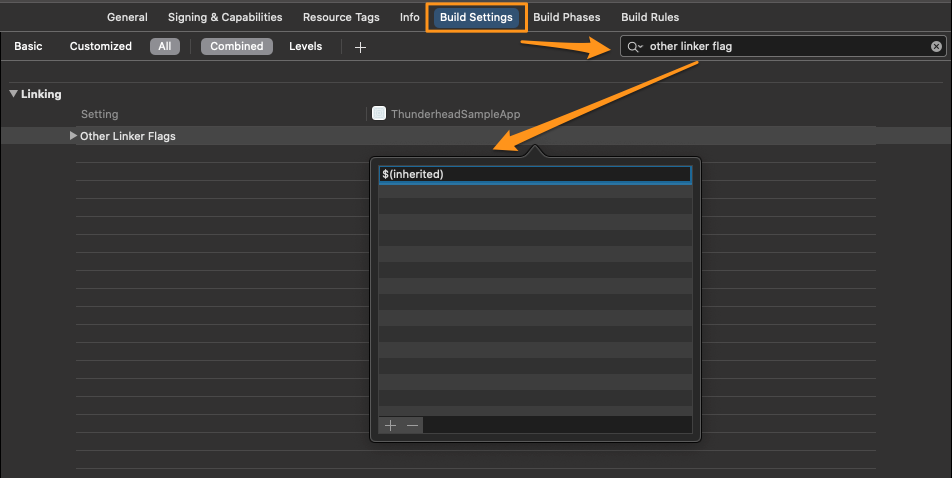
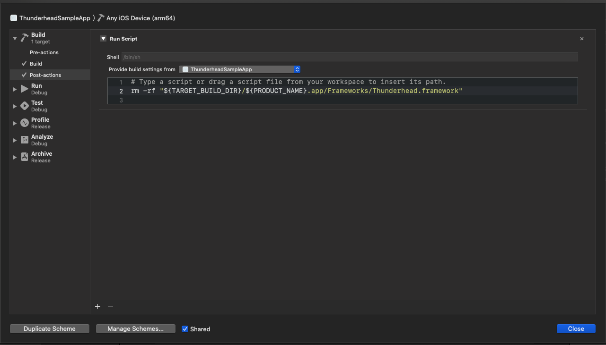

The Thunderhead SDK for iOS Troubleshooting Guide for common implementation issues.

- [Installation and archiving troubleshooting](#installation-and-archiving-troubleshooting)
  * [No such module 'Thunderhead' Xcode compile error](#no-such-module--thunderhead--xcode-compile-error)
  * [Resolve `Undefined symbols for architecture arm64` compile time error](#resolve--undefined-symbols-for-architecture-arm64--compile-time-error)
  * [Archive Error SPM - Found an unexpected Mach-O header code: 0x72613c21](#archive-error-spm---found-an-unexpected-mach-o-header-code--0x72613c21)
- [How to resolve `WKWebView` tracking issues](#how-to-resolve-wkwebview-tracking-issues)
  * [Disable `WKWebView` tracking via App's Info.plist](#disable-wkwebview-tracking-via-apps-infoplist)
- [Identify why automatic Interaction requests may not be triggered for a View Controller](#identify-why-automatic-interaction-requests-may-not-be-triggered-for-a-view-controller)
  * [Ensure you are calling `super` when overriding View Controller lifecycle methods](#ensure-you-are-calling--super--when-overriding-view-controller-lifecycle-methods)
    + [How to identify when this is the issue](#how-to-identify-when-this-is-the-issue)
    + [How to resolve this issue](#how-to-resolve-this-issue)
- [Deny/Block Network Connections in Xcode Simulator](#deny-block-network-connections-in-xcode-simulator)
  * [How to reduce Console connection failure messages in Xcode](#how-to-reduce-console-connection-failure-messages-in-xcode)

## Installation and archiving troubleshooting 
### No such module 'Thunderhead' Xcode compile error

When integrating the Thunderhead SDK manually into your app, you may encounter this compile error.

To resolve this, navigate to **Build Settings**, ensure the **Framework Search Paths** contains the framework filepath. If the framework is placed in your project directory, simply set the framework search path to `$(SRCROOT)` and set it to recursive.

### Resolve `Undefined symbols for architecture arm64` compile time error

When integrating the Thunderhead SDK via [CocoaPods](https://github.com/thunderheadone/one-sdk-ios#cocoapods), you may encounter this compile time error.

To resolve this error, go to app target's **Build Settings**, add `$(inherited)` to **Other Linker Flags**, which will add the linker flags generated by the Pods to your app.



### Archive Error SPM - Found an unexpected Mach-O header code: 0x72613c21

When try to upload/distribute an archive, you may encounter this error, if Thunderhead SDK was integrated via [SPM](https://github.com/thunderheadone/one-sdk-ios/#swift-package-manager).

To resolve this error, add the following **Run Script** to the scheme's **Build Post-actions**:

```sh
rm -rf "${TARGET_BUILD_DIR}/${PRODUCT_NAME}.app/Frameworks/Thunderhead.framework"
```

*Note:* 

- Make sure to select **Provide build settings** from the app.

  

- Please note this issue has already been reported to Apple's Swift Team. To track this bug [click here](https://bugs.swift.org/browse/SR-13343).

## How to resolve `WKWebView` tracking issues

If you come across issues with `WKWebView` tracking, try the following:

### Disable `WKWebView` tracking via App's Info.plist
- Disable `WKWebView` codeless tracking by adding the following to your app’s Info.plist file and set `DisableWKWebViewTracking` to `YES` (boolean value).


```xml
<key>Thunderhead Config</key>
<dict>
  <key>Swizzling Options</key>
  <dict>
    <key>DisableWKWebViewTracking</key>
    <true/>
  </dict>
</dict>
``` 
## Identify why automatic Interaction requests may not be triggered for a View Controller
### Ensure you are calling `super` when overriding View Controller lifecycle methods 
The SDK relies on the [View Controller lifecycle methods](https://www.github.com/thunderheadone/one-sdk-ios#viewcontrollerview-lifecycle-overriding-rules) being called to automatically capture Interaction events. Therefore it is required for the client app to call `super`, when lifecycle methods are overridden, to notify the OS of the method call.  

#### How to identify when this is the issue
If the lifecycle methods are not configured correctly you may only see the interaction path being configured, for example:
```
 [Thunderhead] Thunderhead SDK assigned interaction path AAPLWorkingWithURLViewController based on class name to the view controller <AAPLWorkingWithURLViewController: 0x7ffd0f811b10>
```

In other cases you may only see the View Controller dissapearing being logged, for example:
```
Thunderhead] handleViewWillDisappear for : <AAPLWorkingWithURLViewController: 0x7ffd0f811b10>
```
#### How to resolve this issue 
Ensure you are calling `super` when overriding any of the methods outlined [here](https://www.github.com/thunderheadone/one-sdk-ios#viewcontrollerview-lifecycle-overriding-rules).

Example of an automatic Interaction being triggered correctly:
```
2021-01-28 11:51:30 +0000 : [Thunderhead] handleViewWillAppear for : <AAPLWorkingWithURLViewController: 0x7fcb74634870>
2021-01-28 11:51:30 +0000 : [Thunderhead] Thunderhead SDK assigned interaction path AAPLWorkingWithURLViewController based on class name to the view controller <AAPLWorkingWithURLViewController: 0x7fcb74634870>
2021-01-28 11:51:31 +0000 : [Thunderhead] handleViewDidAppear for : <AAPLWorkingWithURLViewController: 0x7fcb74634870>
2021-01-28 11:51:31 +0000 : [Thunderhead] The interaction /AAPLWorkingWithURLViewController has a trackable navigation bar's title
[Thunderhead]  Task OneAutomaticInteractionOperation: /AAPLWorkingWithURLViewController: has started
[Thunderhead] Task OneAutomaticInteractionOperation: /AAPLWorkingWithURLViewController: URL request string: https://server.thunderhead.com/one/oauth1/rt/api/2.0/interaction?sk=ONE-AT7BTSA1HJ-7422&tid=b4bc40d0-5718-6676-18b4-1f59ecb040ca&pv=LTE2MTAwNTI2Mjg2Mzc
2021-01-28 11:51:31 +0000 : [Thunderhead] The HTTP request for the task OneAutomaticInteractionOperation: /AAPLWorkingWithURLViewController: ---REQUEST------------------
BODY: {"uri":"ios://sdkSampleApp/AAPLWorkingWithURLViewController","device":{"locale":"en_US","osName":"IOS","devMfr":"Apple","appVer":"0.47.0","appName":"com.thunderhead.UICatalog.admin","ipAddress":"detect","devType":"SMARTPHONE","devModel":"x86_64","osVer":"14.3"}}
2021-01-28 11:51:31 +0000 : [Thunderhead] The HTTP response for the task OneAutomaticInteractionOperation: /AAPLWorkingWithURLViewController:
2021-01-28 11:51:31 +0000 : [Thunderhead] View controller not mapped for interaction path /AAPLWorkingWithURLViewController due to the Interaction response data object having no trackers, captures or optimizations
[Thunderhead] Task OneAutomaticInteractionOperation: /AAPLWorkingWithURLViewController: has finished
2021-01-28 11:51:32 +0000 : [Thunderhead] View controller not mapped for interaction path /AAPLWorkingWithURLViewController due to the Interaction response data object having no trackers, captures or optimizations
```

## Deny/Block Network Connections in Xcode Simulator
### How to reduce Console connection failure messages in Xcode
For developers that use an external tool (i.e. Little Snitch) to deny/block network connections coming from the Simulator, you may find that Xcode spams the debug area console with a large amount of network log errors, like below: 

```
2020-01-20 09:33:28.281517+0100 SampleApp[27123:934708] [] nw_socket_connect [C905.1:3] connect failed (fd 13) [64: Host is down]
2020-01-20 09:33:28.281642+0100 SampleApp[27123:934708] [] nw_socket_connect connect failed [64: Host is down]
2020-01-20 09:33:28.282565+0100 SampleApp[27123:934708] Connection 2: received failure notification
2020-01-20 09:33:28.282673+0100 SampleApp[27123:934708] Connection 2: failed to connect 1:64, reason -1
2020-01-20 09:33:28.282808+0100 SampleApp[27123:934708] Connection 2: encountered error(1:64)
2020-01-20 09:33:28.286154+0100 SampleApp[27123:934708] Task <EC494682-0065-4970-A221-C23EC09C2A06>.<708> HTTP load failed, 0/0 bytes (error code: -1004 [1:64])
2020-01-20 09:33:28.286590+0100 SampleApp[27123:934657] Task <EC494682-0065-4970-A221-C23EC09C2A06>.<708> finished with error [-1004] Error Domain=NSURLErrorDomain Code=-1004 "Could not connect to server." UserInfo={NSUnderlyingError=0x600003d8b750 {Error Domain=kCFErrorDomainCFNetwork Code=-1004 "(null)" UserInfo={_kCFStreamErrorCodeKey=64, _kCFStreamErrorDomainKey=1}}, NSErrorFailingURLStringKey=https://eu2.thunderhead.com/one/oauth1/2020-01-20 09:33:28.296102+0100 SampleApp[27123:934708] [] nw_socket_connect [C906.1:3] connect failed (fd 13) [64: Host is down]
rt/api/2.0/interaction/offline?sk=SITE_KEY, NSErrorFailingURLKey=https://servername.com/one/oauth1/rt/api/2.0/interaction?sk=SITE_KEY, _kCFStreamErrorDomainKey=1, _kCFStreamErrorCodeKey=64, NSLocalizedDescription=Could not connect to server.}
2020-01-20 09:33:28.304717+0100 SampleApp[27123:934708] [] nw_socket_connect connect failed [64: Host is down]
2020-01-20 09:33:28.307448+0100 SampleApp[27123:934708] [] nw_socket_connect [C906.2:3] connect failed (fd 13) [64: Host is down]
2020-01-20 09:33:28.307579+0100 SampleApp[27123:934708] [] nw_socket_connect connect failed [64: Host is down]
2020-01-20 09:33:28.310252+0100 SampleApp[27123:934708] [] nw_socket_connect [C906.3:3] connect failed (fd 13) [64: Host is down]
2020-01-20 09:33:28.310392+0100 SampleApp[27123:934708] [] nw_socket_connect connect failed [64: Host is down]
2020-01-20 09:33:28.312445+0100 SampleApp[27123:934708] [] nw_socket_connect [C906.4:3] connect failed (fd 13) [64: Host is down]
```

These are **Apple error logs** logging *all* failed outgoing network connections configured with an external tool (i.e. Little Snitch) to block outgoing network calls in the Xcode Simulator. Below are potential solutions to help filter the Apple error logs that you see: 
- Disable the OS (Operating System) Logs by setting `OS_ACTIVITY_MODE` = `disable` in your App Scheme Configuration. 
    - See [here](https://stackoverflow.com/questions/37800790/hide-strange-unwanted-xcode-logs)
- Or, if you require to see the OS logs and only want to filter Thunderhead SDK's network calls, you can temporarily opt out an end-user from all tracking.  
	- See [here](docs/additional-features-guide.md#opt-an-end-user-outin-of-all-tracking)

## RxSwift 

### `UITableView` and/or `UICollectionView` cells no longer clickable or tappable

For apps using RxSwift `UITableView` and `UICollectionView` delegate methods with our SDK integrated, you may encounter an issue where the `UITableViewCell` or `UICollectionViewCell` is no longer clickable or tappable.  In which case you may be using the Reactive wrapper method `rx.modelSelected` or `rx.itemSelected` for delegate message `collectionView(_:didSelectItemAtIndexPath:)`, and these methods no longer trigger.

If you are encountering this or other delegate related issues, please ensure that you are setting the `UICollectionView` or `UITableView` delegate using the Reactive wrapper method `rx.setDelegate()` and **not** directly i.e. `collection.delegate = self`.  Setting the delegate directly results in unexpected behavior in delegate callbacks.  We are investigating the root cause and looking to fix this in a future version.  
