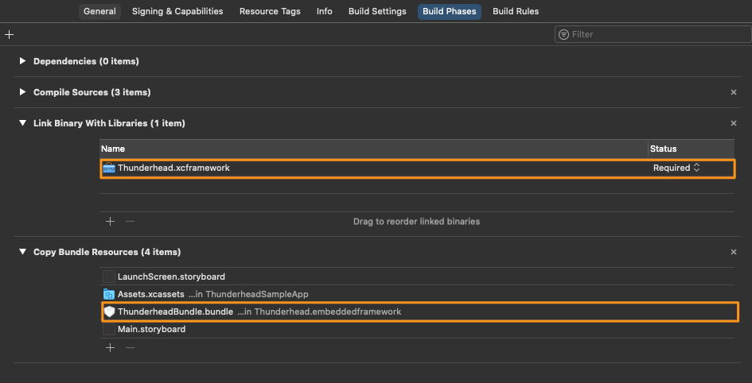

# Thunderhead iOS SDK Migration Guide

## Thunderhead SDK 5.x to 6.0

Thunderhead SDK 6.0 is a compatibility release for iOS 14 support. It adds a number of new features and drops support for iOS 8. 

### XCFramework Integration

Thunderhead SDK 6.0 for iOS is bundled as .xcframework files (XCFrameworks) instead of as .framework files. If you’re using the manual integration, you need to remove the old frameworks from the Frameworks, Libraries, and Embedded Content section of your target and add the XCFrameworks instead. Also, you need to remove the old Bundle from Bundle Resources and add the new Bundle into Bundle Resources.

