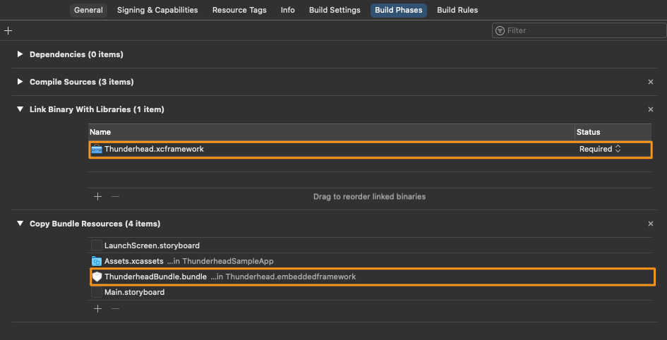

# Thunderhead iOS SDK Migration Guide

## Thunderhead SDK 5.* to 6.*

Thunderhead SDK 6.+ is a compatibility release for iOS 14 support. It adds a number of new features and drops support for iOS 8. 

### XCFramework Integration

Thunderhead SDK 6.+ for iOS is bundled as .xcframework file (XCFramework) instead of as .framework file. If you’re using the manual integration, you need to remove the old framework from the Frameworks, Libraries, and Embedded Content section of your target and add the XCFramework instead. Also, you need to remove the old Bundle from Bundle Resources and add the new Bundle into Bundle Resources.

### Push Notifications

Support for push notifications from Thunderhead ONE or Salesforce Interaction Studio has been removed starting with Thunderhead SDK 6.0.0. If you're using any of the following ONE API's, you need to remove them from your codebase when you are integrating Thunderhead SDK 6.+.

<rm>Removed</rm> `enablePushNotifications`

<rm>Removed</rm> `getPushToken`

<rm>Removed</rm> `sendPushToken`
